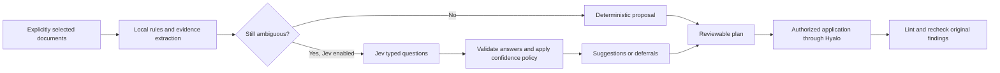

# Jev for Hyalo: opt-in classification and tidy assistance

Jev looks useful as an optional decision service between Hyalo's local discovery
and its existing mutation commands. The best initial feature is **suggesting
missing document types, existing destination folders, and controlled tags**.
The main engineering work is defining the vault's classification policy and
validating proposed changes. Calling the API is the small part.

Recommendation: begin with a Jev-assisted branch of `hyalo-tidy`, producing a
reviewable proposal. Once its value is measured on representative vaults, add a
native, explicitly invoked `hyalo classify` command. Keep normal Hyalo commands
local, deterministic, and usable without credentials. Do not make semantic
classification an implicit part of `lint --fix`.

This is research and a proposed design, not an implemented integration. No existing
notes were reclassified or moved. Experiments used synthetic documents, 17 selected
Hyalo note excerpts, and a disposable test vault. Reproducible fixtures and detailed
results are in [[research/jev-classification-evidence-2026-09-20]]. Related context:
[[research/karpathy-llm-wiki]] and [[docs/schema-and-lint]].

## What the API actually offers

`POST https://api.typesafe.ai/v1/systemone` accepts a shared `state`, a model ID,
and named questions. **Choice** selects one supplied option; **Noul** returns a
yes/no probability; **Score** rates against ordered descriptions. Jev does not
generate prose, arbitrary YAML values, filenames, or explanations. Question IDs
are response keys, not instructions: every question must explicitly identify its
document and relevant fields. Questions cannot use one another's answers.
See the [HTTP API](https://docs.typesafe.ai/api).

As checked on 2026-09-20, `jev-1.13.0` costs **$0.042 per million input tokens**;
output tokens are free. The advertised limits are 64k tokens per request and
32k for state plus the longest question. The documented rate limits are 1,200
requests/minute and 250,000 tokens/second, explicitly subject to change. Input is
text; English is strongest. The published SDK choices are Python and JavaScript;
Rust can use HTTP directly. Pin a version rather than `jev-latest` when evaluating
thresholds. Sources: [models](https://docs.typesafe.ai/models),
[SDKs](https://docs.typesafe.ai/sdk).

Confidence is derived from the answer's probability distribution. Checking both
confidence and winning probability does not provide two independent correctness
checks. The existing Jev helper suggests a Choice only at confidence ≥ 0.85 and
winning probability ≥ 0.90, and always defers `unknown`. These are initial
thresholds, not calibrated guarantees for Hyalo. A Noul has no separate confidence;
the helper suggests yes at ≥ 0.90 and no at ≤ 0.10. A Score is a position on a
rubric, not a correctness percentage. See
[confidence](https://docs.typesafe.ai/confidence).

The documented weaknesses are directly relevant: literal interpretation, numeric
and date reasoning, indirection, distracting state, adversarial text, and
contradictory rubrics. Counts, dates, path resolution, schema checks, and Git facts
belong in code. See [Jev's limitations](https://docs.typesafe.ai/model-jaggedness/jev-1.13).

## What the experiments showed

| Experiment | Observed result | Implication |
| --- | --- | --- |
| 20 synthetic document kinds | 19 best choices matched; 16 suggestions, all matching | Clear purpose classification works in this small sample; uncertainty matters |
| 17 existing Hyalo documents | 14 matched stored types; 11 suggestions, all matching | Existing labels provide a useful starting corpus, but are not independent truth |
| 8 topical folder choices | All 8 matched; 6 suggestions, 2 no-fit deferrals | Map a selected category to a local path; do not generate paths |
| Type, two tags, and source URL | All four decisions matched in all nine timing groups | Independent fields can share a request |
| Six severity enum cases | 5 best choices matched; zero suggestions | Enum membership alone does not make a task easy; priority semantics need better rubrics |
| Four tag boundary cases | Three correct suggestions; one borderline case deferred | Topic mentions and substantive coverage need explicit distinctions |

The most informative result came from a follow-up. A dogfooding report has
`type: research` in this vault. With generic rubrics and that document alone,
Jev suggested `review` at probability 0.93 and confidence 0.91. It cleared both
thresholds while disagreeing with the vault's convention. Two other disagreements
involved a larger dogfooding report and a preserved upstream issue submission.

Adding explicit local rules — dogfooding reports count as research, code inspection
as review, and upstream communication records as docs — made all three choices
match. This was an **in-sample rubric repair**, not held-out validation. It shows
why the product needs user-controlled category descriptions and exceptions. It
does not justify increasing automated write coverage. The reports' existing
labels could themselves be debatable; Jev should surface that ambiguity rather
than silently impose its own taxonomy.

Four questions about one short document, medians of three rounds:

| Execution | Wall time | Input tokens per group |
| --- | ---: | ---: |
| One batched request | 603 ms | 777 |
| Four sequential requests | 2,629 ms | 1,878 |
| Four concurrent requests | 759 ms | 1,878 |

Batching was **4.36× faster than sequential calls**, about **1.26× faster than
concurrent calls**, and used **58.6% fewer input tokens**. This measures a small
warm-process Python client sample, including HTTP latency, not an end-to-end tidy
or a service SLA. No primary-agent/LLM baseline was measured.

All 43 live requests consumed 47,710 input and 5,402 output tokens: approximately
**$0.00200382** at the published rate. This is an estimate, not an invoice. For
perspective, 1,000 documents averaging 2,000 billed input tokens each would cost
about $0.084 for one pass; 10,000 would cost $0.84. Those are arithmetic scenarios,
not measured vault costs or throughput forecasts. Question descriptions,
candidate lists, retries, and dependent passes all contribute input tokens.

## Use cases, in priority order

| Use case | Local preparation | Jev decision | Result and boundary |
| --- | --- | --- | --- |
| Missing `type` | Resolve schema bindings/defaults first; select genuinely ambiguous files | Choice among declared types plus unknown | Propose only a missing value; preserve a valid path-bound type without materializing redundant frontmatter |
| Inbox filing | Supply approved folders with descriptions and a short document excerpt | Choice among folder IDs plus keep/unknown | Local code preserves basename, resolves destination, and previews `hyalo mv` |
| Controlled tags | Gather approved tag vocabulary; shortlist relevant candidates | One Noul per tag | Add multiple applicable tags; never use one Choice for a multi-label field |
| Tag normalization | Find near-duplicates locally, include usage examples | Same meaning / distinct / unclear | Propose canonical mapping; frequency is supporting evidence, not authority |
| Domain enums | Read declared values and human-written meanings | Choice, e.g. tutorial/reference/concept or audience | Propose an allowed value; do not invent enum options |
| Source/author/date roles | Parse candidate spans from Markdown or frontmatter | Select which existing span plays the requested role | Copy exact local value; normalize dates and validate in code |
| Type-folder inconsistency | Compare current metadata with configured routing rules | Assess ambiguous exceptions only | Report possible misfiling; an unusual folder is not automatically wrong |
| Tidy reading order | Gather orphan/dead-end/missing-metadata findings deterministically | Score actionability against a narrow rubric | Help the main agent read useful documents first; retain mandatory findings |
| Related-note suggestions | BM25 shortlist plus title/heading/snippet | One relevance or relationship question per candidate | Suggest cross-references; do not scan every pair in the vault |
| Ambiguous link repair | Existing resolver produces plausible targets | Choice including no-match | Advisory candidate ranking; preserve existing ambiguity safeguards |
| Backlog-to-implementation matching | Retrieve likely implementation notes/commits locally | Related / unrelated / uncertain | Reduce what the main agent must inspect; independently verify shipment |
| Duplicate/overlap triage | Exact hashes and lexical similarity first | Duplicate / complementary / distinct / unclear | Suggest a comparison or consolidation review; never delete or merge automatically |
| Stale-claim review | Locate overlapping claims and exact version/date facts | Potentially contradictory or needing review | Identify a pair of passages, not declare which one is true |
| Ingestion routing | Extract text and known source metadata locally | Document kind, topic, relevant existing notes | Dispatch to a generative agent for actual summaries and synthesis |

The first five are the strongest initial candidates. Relationship discovery and
staleness are useful later, but require more context and more careful evaluation.
An orphan can be an intentional entry point; old research can remain valuable.

Some frontmatter should be treated differently even when its syntax is an enum:

- **Descriptive:** type, topic, audience, language. Good classification candidates.
- **Authoritative workflow state:** completed, approved, published, superseded.
  Require independent evidence and the appropriate write authorization. Jev can
  find a relevant claim; it cannot establish that tests passed or work shipped.
- **Free text:** summary, newly invented title, arbitrary aliases. Use a generative
  agent or select an existing span; Jev cannot author these.
- **Structured data:** nested object lists need richer mutation support. Hyalo's
  current `set`/`append` interface does not author individual object-list entries.

## How it fits the current code

Source inspection used commit `332efea6e0af87b93b6d8895502a4d28a553808b`.
Local command experiments used `hyalo 0.24.1 (13e9999712b0 2026-09-20)` from
`target/release/hyalo`; the binary was not rebuilt for this research.

| Existing component | Reuse | Missing piece |
| --- | --- | --- |
| `hyalo-core/src/schema.rs` | Types, enum values, defaults, path bindings, required sections | Semantic descriptions and domain exceptions; `TypeSchema` currently has no description field |
| `find`, `read`, BM25, link graph | Local selection, current content, candidate retrieval | Bounded evidence export suitable for batches |
| CLI `commands/set.rs` | Typed value parsing, guarded selection, `--validate`, preview | Full resulting-document validation when a type changes |
| CLI `commands/mv.rs` | Destination checks and inbound/outbound link rewriting | Classification ID-to-path mapping and proposal binding |
| CLI `commands/apply.rs`, `hyalo-core/src/rooted.rs` | Prepared writes, source conflicts, effect reporting | Durable semantic proposal format and coordinated application |
| CLI `config.rs` | Effective config, malformed-config handling | Optional classification policy and explicit runtime enablement |
| Tidy skill templates | Audit/repair orchestration and reporting | Consistent optional Jev branch across all distributions |

`commands/apply.rs` is an **internal module**, not an existing `hyalo apply`
subcommand. Its contract prepares before serial publication and explicitly does
not promise rollback. A future semantic plan must not claim a multi-file
transaction simply because it reuses this machinery.

A disposable-vault check confirmed that `set --property type=docs --validate`
succeeds even when that schema requires a missing `status`; subsequent strict
lint reports the missing property. Source inspection shows validation of the
assigned properties' constraints, not a complete post-change document check.
Therefore a classifier must validate the complete proposed document, including
required fields/sections and its effective schema at the **destination path**.
Unknown required metadata is an incomplete proposal, not permission to invent it.

The same scratch test confirmed byte-preserving dry runs and an actual `mv` that
rewrote both a Markdown link and a wikilink, leaving no broken links. This validates
the existing command building blocks; it is not a test of an implemented Jev
integration.

## Implementation options

| Option | Advantages | Costs / limitations | Recommendation |
| --- | --- | --- | --- |
| Tidy skill invokes the installed Jev helper | Smallest experiment; no network dependency in Hyalo; main agent handles ambiguous work | Helper availability varies; agent may already have spent tokens reading the content; budgets and policy must be explicit | Start here as an opt-in pilot |
| Separate `hyalo-jev` companion | Keeps the main binary network-free; can consume Hyalo JSON and emit proposals | Extra install/version contract; subprocess and stale-plan coordination | Good distribution choice if keeping network code out of Hyalo is a product priority |
| Native `hyalo classify --provider jev` | Deterministic input preparation, batching, caching, and output contracts; consistent across agents | Adds HTTP/TLS and policy surface; needs meaningful integration tests | Preferred destination if the pilot demonstrates value |
| Provider-neutral command-driven backend | Users could select Jev, a local model, or their own service | More protocol complexity; configured executables introduce a trust boundary | Leave an internal interface seam; defer public arbitrary-command plugins |

An official Rust SDK is not listed in the current docs. Native integration can
use a small typed HTTP adapter. Keep provider transport in the CLI or a separate
`hyalo-classify` crate; keep `hyalo-core`'s parsing, schema, and filesystem code
independent of credentials and network calls. A compile-time feature can support
network-free builds, but **runtime opt-in is still required** for normal binaries.

Do not add a permanent Python script to general repository tooling merely because
the pilot uses the personal Jev helper: [[decision-log#DEC-332: JavaScript is permitted for shipped npm and pi deliverables (2026-09-07)|DEC-332]]
keeps the CLI and general tooling in Rust. The JavaScript SDK is an option for pi's
shipped extension, but duplicating provider policy in pi would fragment behavior.

### Suggested pipeline



Resolve deterministic cases first. A configured `type → folder` mapping needs no
second API decision after the type is known. A topical folder independent of type
can be asked alongside it. If selecting a type determines which enum values or
folder subtree are relevant, either ask conditional questions with self-contained
rubrics and ignore irrelevant results, or make a second request.

For modest vocabularies, a flat Choice is simplest. For hundreds of folders,
retrieve a small candidate set first and keep a no-match outcome. A hierarchical
classifier can retain several plausible branches rather than greedily discarding
alternatives; TypeSafe has a [hierarchical classification cookbook](https://docs.typesafe.ai/cookbooks/hierarchical_classification).
Its path score is a ranking heuristic, not calibrated end-to-end correctness.
If several leaf folders remain plausible, keep the file where it is and suggest
the broader category for review.

Batch multiple questions about one document first. Small batches of related
documents may also work, but every question sees the whole state: unrelated notes
can distract the model. This experiment used at most five synthetic or four real
documents per classification batch, constrained by the helper's 24,000-byte cap.
Those are conservative experimental limits, not vendor token limits. Benchmark
packing strategy before advertising vault-scale throughput.

### Policy and proposal design

Illustrative configuration only — these keys do not exist today:

```toml
[classify]
provider = "jev"
model = "jev-1.13.0"
include = ["inbox/**/*.md"]
exclude = ["private/**", "**/credentials/**"]
properties = ["type"]
overwrite = false

[classify.types.research]
description = "Investigations and dogfooding reports; code inspection belongs to review."
destination = "research/"

[classify.types.docs]
description = "Usage guides, reference material, and preserved upstream communication."
destination = "docs/"
```

Keep these mappings separate from validation initially: the schema says what is
valid; the classifier policy says how to infer it. Read allowed enum values from
the schema and validate that descriptions refer to declared options. Descriptions
could later become reusable schema annotations, with a deliberate compatibility
change. Do not assume that a `filename-template` is a migration rule.

The proposal should contain document IDs mapped locally to paths, source content
hashes, current values, proposed values, candidate/policy/schema fingerprints,
model and rubric version, probabilities, deferral reasons, local evidence spans,
projected moves and link changes, truncation information, and usage/cost telemetry.
Reasons such as `low-confidence`, `missing-evidence`, `policy-conflict`, and
`no-matching-folder` come from code; do not fabricate a model explanation.

On application, re-read and revalidate the source, effective schema, folder
mapping, and files whose links will change. Capture both old and destination
bindings. Reject stale or conflicting proposals; do not silently call Jev again
and apply a different answer. Map opaque candidate IDs to approved local paths;
never interpret a model response as a shell command. Group compatible edits and
use the existing rooted writers, with honest partial-effect reporting on failures.

For moves that rewrite other documents, show that full local write set. Network
disclosure scope and local mutation scope are separate: fixing a backlink need
not send that referring document to TypeSafe.

## A concrete opt-in contract

| Situation | Proposed behavior |
| --- | --- |
| Normal `find`, `lint`, `lint --fix`, `summary`, or tidy without Jev selection | Zero Jev requests; existing behavior |
| `TYPESAFE_API_KEY` exists | Credentials are available; no automatic activation |
| Repository config contains a provider | Policy defaults only; a cloned config does not authorize disclosure |
| User asks for this tidy run to use Jev | Use it for the selected scope and fields; no additional per-request confirmation |
| User explicitly stores a trusted per-vault preference | Reuse that authorization within its declared scope; allow a per-run disable override |
| Audit with Jev explicitly enabled | Classification may send authorized excerpts; no note/index/cache writes by default |
| Preparation / `--dry-run` | Local payload and change preview; no network, cache writes, or note writes |
| Missing credentials, timeout, or service error in optional tidy assistance | Mark Jev unavailable and continue deterministic audit / ordinary agent reasoning |
| Explicit standalone classification fails | Report structured unavailability and incomplete work; never return an empty success |
| A successful classification result | A suggestion, not write authorization |

An illustrative future invocation would be:

```sh
# PROPOSED CLI, not available in Hyalo 0.24.1.
hyalo classify --provider jev --glob 'inbox/**/*.md' --format json
```

Initially it should only emit suggestions. Tidy can then preview existing commands:

```sh
# Existing commands; example paths and values.
hyalo set inbox/note.md --property type=research --validate --dry-run
hyalo mv inbox/note.md --to research/note.md --dry-run
```

When the user already authorized repair, the agent can apply verified changes
within that scope after preview. An audit remains read-only. Enabling Jev must not
silently enable mutation, expand the selected folders, override valid metadata,
create schemas, normalize the entire tag vocabulary, or start background runs.

Minimize transmitted data: approved excerpts, permitted frontmatter fields,
candidate descriptions, and opaque IDs. Do not automatically include Git logs,
agent memories, unrelated files, or secrets just because the longer tidy workflow
consults them locally. A credential scanner is only a backstop, not proof that
content is safe to disclose. Prompt text inside documents remains untrusted.

TypeSafe states that it does not train on customer input. That does **not** mean
the ordinary API has zero retention: its documentation offers ZDR for enterprise,
and its DPA describes purpose-based retention rather than a universal fixed
deletion interval. Do not label the integration local or zero-retention by default.
Sources: [privacy policy](https://typesafe.ai/legal/privacy-policy),
[legal overview](https://docs.typesafe.ai/legal),
[DPA](https://typesafe.ai/legal/data-processing).

Keep caches outside the vault, private and optional, keyed by exact evidence,
candidate set, rubric, pinned model, schema and policy. Cache typed suggestions
and non-sensitive IDs rather than document bodies; decisions can still be
sensitive. Invalidate on changes and revalidate against current source before
acting. A snapshot index is not a substitute for content identity.

Bound requests, bytes, selected files, concurrency, timeout, and retries; report
actual token usage. Label cost projections as estimates without a reliable
tokenizer. Honor rate-limit responses with bounded backoff, never retry auth or
invalid-request failures indefinitely, and never forward the bearer key across
an HTTP redirect. Do not silently fall back to a different external provider.

## Changes needed in hyalo-tidy

There are three canonical instruction surfaces:

- Codex: `plugins/hyalo/skills/hyalo-tidy/SKILL.md`, copied into
  `crates/hyalo-cli/templates/codex/skills/` by the Codex package sync workflow.
- Claude: `crates/hyalo-cli/templates/skill-hyalo-tidy.md`.
- pi: `pi-package/skills/hyalo-tidy/SKILL.md`, vendored under
  `crates/hyalo-cli/templates/pi/skills/` by the pi package sync workflow.

The Codex skill already distinguishes an audit from repair and avoids index
writes in an audit. The longer Claude and pi versions create an index at the
start and direct later cleanup/mutations. Harmonize the audit/repair contract as
part of a shared Jev addition; do not copy the longer workflow's unconditional
index behavior into the optional path.

Place Jev after deterministic discovery and before the agent reads every candidate
in full. Otherwise the main agent has already paid much of the context cost Jev
was intended to save. Pass narrow, structured evidence, consume the compact
answers, and inspect deferred/contradictory proposals with the main agent.

The report should distinguish files examined locally, files sent to Jev, accepted
suggestions, deferrals, unavailable requests, changes actually made, validation
failures, and estimated cost. A low-confidence result is useful information; it
must not disappear from the audit.

## Recommended delivery sequence

1. **Pilot the skill path.** Explicit Jev invocation, small selected batches,
   missing types and approved tags, with local folder mappings and proposals only.
   Use the personal helper while evaluating; do not make it a mandatory plugin
   dependency. Preserve the ordinary tidy fallback.
2. **Build a representative evaluation set.** Human-confirm ambiguous local labels;
   include overlapping categories, non-English notes, long documents, injected
   instructions, misleading titles, missing evidence, and unusual schemas. Keep
   held-out fixtures separate from rubric tuning.
3. **Add native proposal generation if the pilot is valuable.** Typed transport,
   local selection/evidence preparation, explicit enablement, budgets, stable JSON,
   reproducible request hashes, and no network calls in existing commands.
4. **Add durable application separately.** Complete candidate validation, stale
   source/config rejection, missing-only defaults, destination collisions and
   path binding checks, link rewrite previews, and honest per-file effects.
5. **Expand to semantic retrieval and relationships.** Only after measuring actual
   reading/context savings; keep completion decisions and prose synthesis with
   code plus the main agent.

Before permitting unattended accepted changes, measure accepted-label precision
and coverage separately, especially wrong accepted overwrites and wrong folder
moves. Zero errors on this small sample cannot establish a production error rate.
Track disagreement with local conventions, truncation, retry cost, and the actual
main-agent calls/context avoided. Compare against both deterministic rules and an
ordinary tidy session, not only sequential Jev requests.

The implementation's critical tests are zero requests when disabled even with a
key present; malformed/unknown answers; abstention; schema and policy changes;
source edits after classification; full destination-schema validation; collisions
and symlinks; partial publication; and audit/dry-run byte preservation. Run the
existing Codex/pi template synchronization checks when those surfaces change.
Keep live API evaluations explicitly invoked and out of ordinary CI.
