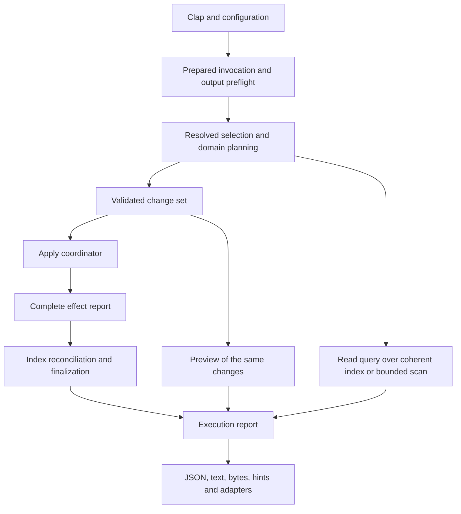

# Rust architecture review and remediation sequence

Hyalo needs stronger ownership of operations and derived state. The existing crate split is
usable; another directory reorganization, another DTO layer or additional style lints will not
close the observed failure paths. The proposed refactoring keeps the workspace and migrates
real consumers onto a small set of checked boundaries.

This is a design review and a set of planned changes, not evidence that those guarantees
already hold. The full baseline findings are retained in [[reviews/astra-code-review-2026-09-09]].
Every finding has one closure owner in the map below, including the six additional parent
findings and the single R05/S13 duplicate.

## Review basis and boundaries

Baseline: `857517a2c9be9a1c4a8b1c0b451082c81e6ecb09`, inspected on 2026-09-10.
Three independent GPT-6 Astra xhigh architecture assessments covered mutation/filesystem,
document/query/index, and CLI/output/adapter contracts. The parent inspected workspace/public
surfaces, CI/gates, prior iteration plans, combined their designs, and checked the complete
finding map. Architecture observations below are source-supported; runtime proof of the prior
bugs remains the preceding review's evidence. API names are proposed sketches, not implemented
or compiler-verified declarations.

The release build succeeded before final documentation dogfooding. Source code is unchanged by
this planning work. Plans start after iteration 289. Iteration 287 remains in progress solely
for the user-deferred Homefinder consumer task; it is outside this queue and is not a blocking
prerequisite. Existing historical plans are not marked fixed or complete by this review.

The earlier work is relevant: [[iterations/iteration-225-arch-thin-dispatch-typed-hints-core-facade]],
[[iterations/iteration-226-arch-lint-crate-index-journal]],
[[iterations/iteration-285-typed-output-structs]], and
[[research/stability-retrospective-2026-09-06]]. Those delivered useful boundaries and evidence.
This review does not claim the new abstractions are unprecedented; it identifies where the
existing boundaries still fail to control their callers.

## Current architecture and specific structural gaps

| Area | Current evidence | Structural consequence |
|---|---|---|
| Request setup | `run.rs` resolves files-from after hint capture and repeats view/config merging; `commands/inputs.rs` uses `first()` under single-file policy. | Cardinality, empty scope and effective options remain conventions on mutable argument bags. |
| Command context | `dispatch.rs::CommandContext` mixes immutable configuration, mutable snapshot, hint observations, counters and exit override. | Handlers can change global execution/output policy while performing domain work. |
| Write lifecycle | Commands mutate, then call `MutationJournal`, then may return before flush; `commands/journal.rs` explicitly describes dropping dirty unflushed state. | A shared journal cannot ensure maintenance if callers control whether it is reached. |
| Filesystem identity | `mv.rs` uses canonical referent equality for entry moves and string destination keys; indexed regex rebuilds paths from snapshot strings. | Lexical path, followed file, movable entry and catalog target are conflated. |
| Persistence | `fs_util.rs` provides useful sibling-temp replacement but post-persist permission updates can fail; config writers truncate in place. | `Result<()>` does not describe committed-but-finalization-failed effects. |
| Ambient policy | `fs_util.rs::PHASE` changes durability/progress process-wide; link alias mode also uses global state. | Concurrent or nested library uses can inherit unrelated invocation policy. |
| Document syntax | Frontmatter framing has multiple loops plus a lint substring splitter; body classification is split across LineScanner, BodyState and BodySpans. | Readers, writers, lint and structural visitors disagree about the same source bytes. |
| Query evaluation | `bm25.rs` mixes document eligibility with scoring over flat clauses. | Partial phrases and negative phrases gain incorrect Boolean meanings. |
| Link identity | Discovery, rewrite resolution and graph construction independently normalize targets; resolver caches may contain only paths. | Backlinks, alias handling and repair policy can disagree with displayed resolved links. |
| Derived state | `SnapshotIndex` exposes selective entry/graph operations; named refresh and journal updates manually copy subsets. | Entries, anchors, catalog, graph, token language and BM25 can become mutually inconsistent. |
| Output | Existing named Serialize structs become JSON strings in CommandOutcome, then are parsed by OutputPipeline; user errors are preformatted strings. | Type information is discarded prematurely, errors arrive after effects, and empty results bypass projections. |
| Companion contracts | npm already has typed DTOs, transports and diagnostics; generic Pi and raw-argv helpers use different paths. | Wrapper behavior and automatic-check promises diverge despite shared artifacts. |
| Quality gates | Mutation-journal and feature-fanout checks largely inspect source/help tokens; two other named checks return success as explicit stubs. | Presence of a helper/flag is measured instead of actual ownership, scope or failure behavior. The stubs are not in quality-gates CI. |

Source anchors: `crates/hyalo-cli/src/run.rs:1960`, `commands/inputs.rs:188`,
`commands/journal.rs:38`, `output.rs:58`, `dispatch.rs:159`;
`crates/hyalo-core/src/fs_util.rs:278`, `fs_util.rs:329`, `fs_util.rs:365`,
`link_rewrite.rs:592`, `scanner/mod.rs:183`, `frontmatter/parse.rs:819`,
`bm25.rs:656`, `index.rs:969`, `index.rs:1002`, `link_graph.rs:637`;
`crates/hyalo-mdlint/src/rules/spans.rs:393`.
Line numbers describe the reviewed baseline; find symbols again before implementation.

## Target ownership inside the existing crates

| Owner | Responsibility | Must not own |
|---|---|---|
| CLI request/application modules | Normalize Clap/config/view inputs once; select command capabilities, target cardinality, output plan and index intent. | YAML parsing internals or ad hoc low-level writes. |
| Core rooted filesystem module | Checked roots and relative names, captured source identity/version, confined I/O, exclusive creation/move, explicit write sessions. | Clap, shell hints, JSON envelopes, lint policy or snapshot publication. |
| Core domain modules | Transform captured bytes/values into validated edits; expose document facts, query eligibility and resolution results. | Printing, process exit, ambient config or invocation-wide apply orchestration. |
| CLI mutation coordinator | Prepare entire requested work, apply, retain every effect, finish durability, reconcile index and form an execution report. | Silently claiming rollback or deciding outcome from the final error alone. |
| Core index owner | Complete scan replacement, immutable catalog, coherent graph/search generations and bounded refresh. | Output formatting or command-specific selection/hints. |
| mdlint | Rules, configuration, severity, profiles and fix proposals over shared syntax facts. | Its own incompatible frontmatter/body boundaries or direct file publication. |
| CLI renderer/hints | Render typed reports; derive replay from resolved requests and raw argv. | Reconstructing scope from a partial copy or changing domain exit/error state. |
| npm/Pi adapters | Spawn/transport, typed decoding, diagnostics presentation and promised follow-up checks. | A second definition of CLI defaults, effect semantics or generated result schema. |

A proposed invocation flow is:



### Requests and capabilities

Keep the real Clap DTOs and generated TS input vocabulary. Introduce private-field prepared
requests and concrete command-family specs, not one enormous request with every option. A
single target resolves to one captured selection, an explicit empty input or a user error;
multiple targets never disappear through `first()`. An explicit empty collection is distinct
from default whole-vault scope.

An exhaustive command-capability match establishes output/count/projection support, selection
policy and effect/index role before any mutation. Normalize aliases and nested actions before
looking up capabilities. `IndexIntent::Drop` resolves its destination but does not load an
index just to delete it. Preserve the explicit CWD-relative index-path contract.

Output preflight rejects incompatible modes and malformed jq before effects. Compilation
itself must be bounded; moving an unsafe compiler into the main process is not a fix. The
minimal worker seam starts with preflight and is completed by the resource-isolation plan.

### Prepared operations and effects

Use types to distinguish proof of validation from an arbitrary path or byte string. Prefer
private fields and consuming apply APIs; cloning execution authority should not be routine.
These are illustrative shapes, with concrete error/source storage types chosen during the
migration:

```rust
struct CapturedInput { /* root, entry/referent identity, version, bounded source */ }
struct PreparedChangeSet { /* validated edits, target identities, preview */ }
struct ApplyReport { /* every path effect and finalization error */ }

enum EffectState {
    Committed,
    CommittedWithFinalizationError,
    FailedBeforeCommit,
    NotAttempted,
    Restored,
    RestoreFailed,
}

enum IndexDisposition {
    NotUsed,
    Updated,
    Invalidated,
    UpdateFailed,
}

struct ExecutionReport {
    /* command-specific result/error, effects, diagnostics, completeness, status */
}
```

The coordinator validates exact rendered YAML and selectors before the first write, not just
selected schema conditions. Index finalization must be mandatory from the first migrated
command, before the later index-owner refactor exists. A commit can succeed while chmod,
fsync, index persistence or output fails; effects therefore live outside the fallible final
result. Existing `PartialExecuteReport` is a useful starting point, whereas parallel
`execute_plans` currently discards successful paths after another result fails.

Planning cannot mean retaining a full vault's contents in memory. Use bounded captured data,
byte-range/header edits and temporary staging for large apply operations. Preview and apply
use the same transformation/validation; previews must not create note/config/index changes
or hidden replay manifests. Explicit write sessions replace process-global durability and
progress coupling. `finish()` is fallible and observed; Drop is cleanup, not proof of success.

### Rooted I/O, identity and concurrency

Distinguish note-vault, installation, configuration and explicitly selected index roots.
Catalog identities are not capabilities to open files. Check parent components and current
resolution at the I/O boundary; a validated path object only records a point-in-time fact.
The first implementation closes static escapes while honestly retaining any existing
canonicalize-then-open race limit. Handle-relative race-resistant backends are a separate
security guarantee and must not be implied by the type name.

A move acts on a directory entry; a normal edit may follow an in-vault symlink. Canonical
referent equality cannot establish a safe case-only rename. No-replace execution is required
in addition to collision planning: Rust's standard rename can replace a destination.
Filesystem equivalence cannot be implemented by lowercasing on macOS or by using Hyalo's
semantic link-case setting. Preserve supported regular-file case-only moves through a tested
backend; explicitly reject unsafe cases before writes.

Capture version/identity from the same input used to transform, and check before commit.
Use content fingerprints where mtime/size cannot distinguish edits. That detects stale input;
it is not a kernel compare-and-swap against arbitrary editors. A cooperative writer lease,
if introduced, needs explicit root ordering and lifecycle and cannot claim to exclude other
editors. Never retry a toggle/append automatically from stale data. Guarded rollback must
never overwrite an unrelated concurrent edit.

### Shared document facts, query semantics and resolution

Split this work into frontmatter framing/budgets and Markdown body syntax. A shared frame
holds source ranges, newline/BOM policy and exact delimiter boundaries; the bounded reader
stops after allowed frontmatter. Writer validation uses the same normal reader budgets.
The body service supplies visibility and spans for structural visitors and fix rules. Raw
full-text search remains allowed to search code/comments; structural visibility is a distinct
policy, not an excuse to remove searchable text.

Do not build a full YAML/Markdown concrete-syntax tree merely to share framing and visibility.
Retain the useful existing splicer and scanner, compare current implementations against a
source corpus, migrate all consumers and delete the superseded policy loops. YAML block
scalar links need bounded lexical context and source spans, not stripping everything after #.

Query eligibility uses typed Term/Phrase atoms and set operations before BM25 ranking.
Preserve Hyalo's existing flat OR behavior; introducing operator precedence is a product
change outside this refactor. Score only satisfied clauses and use an independent simple
reference evaluator in tests.

One immutable link catalog carries all paths/stems/aliases and explicit completeness.
Resolution returns target identity or missing/ambiguous/external states; rewrite policy then
decides whether and how to change authored spelling. Do not force every occurrence into a
resolved edge or discard unresolved edges from metrics. Remove process-global alias options
from migrated resolution calls.

### Coherent index state

Replace complete scan products, including anchors, language, tokens and diagnostics. The
runtime index owner controls catalog/graph/search generation and does not expose partially
updated state to queries or serialization. Keep persisted DTO compatibility separate from
internal ownership; public `IndexEntry` fields cannot simply be made private in a published
crate without wrappers, deprecation or an explicit version policy.

A target rename, alias edit or new ambiguous stem can change links from unmodified sources.
Retain raw occurrences and initially rebuild catalog/graph once per affected batch. Rebuild
or invalidate BM25 coherently. Do not combine this first correction with a new snapshot
format, database and sophisticated incremental scorer. Add checked expansion budgets before
new reconstruction paths: compact snapshots can otherwise amplify allocations dramatically.
Optimize only after disk/index parity holds, using measured operation counts as well as time.

### Results, diagnostics and agent contracts

The result DTO work already exists. Keep those structs and ts-rs; convert to Value once at
the heterogeneous renderer boundary instead of serialize-to-string then parse. Dynamic
frontmatter remains Value. Use typed errors and diagnostics internally, preserve successful
wire shapes and define optional additive effect/error fields deliberately with npm tests.
Distinct raw text and raw byte variants remain essential for read and NUL filename output.

Hints apply a named transformation to the complete resolved request. Store raw argv; quote
only for display, and never pretend POSIX display is native Windows-shell syntax. If a stdin
selection cannot be represented within the hint budget, omit the executable continuation
rather than broaden it. Scope preservation assumes unchanged input/config; apply still checks
captured source versions. Generic and typed Pi paths share diagnostic rendering and the same
post-write effects for follow-up lint.

## Decisions and alternatives

- Keep core, mdlint, CLI and xtask. Modules with enforced ownership come before new crates.
- Keep synchronous Rust and Rayon where useful; no async runtime, service, event bus,
  dependency-injection container or database is required for the identified failures.
- Use concrete errors at meaningful boundaries and anyhow for contextual unexpected errors;
  neither replace every Result nor add wrappers around strings without an invariant.
- Existing public Rust APIs and generated npm contracts need compatibility treatment.
  A facade comment does not permit silent breaking visibility changes.
- Do not call a cache journal a transaction. State atomic replacement, partial apply,
  conflict detection, durability and race resistance as separate guarantees.
- Do not preserve known wrong results merely to claim a behavior-preserving refactor.
  Record intentional fixes and keep unaffected bytes/formats stable.
- Do not add a duplicate schema generator or a giant command-result enum. Current DTOs and
  ts-rs are sufficient once execution/output ownership is corrected.

The design follows Rust API guidance on enforcing input validity through types or boundary
checks, private fields for invariant-owning values, and explicit fallible finalization.
These are supporting principles, not evidence that the proposed implementation is correct.
See [dependability](https://rust-lang.github.io/api-guidelines/dependability.html) and
[future proofing](https://rust-lang.github.io/api-guidelines/future-proofing.html).
The I/O plan must respect actual platform semantics of
[std::fs::rename](https://doc.rust-lang.org/std/fs/fn.rename.html) and the locked-version
[tempfile persistence API](https://docs.rs/tempfile/3.27.0/tempfile/struct.NamedTempFile.html).

## Execution order and validation cost

The original 25 drafts were too fine-grained for the repository's one-iteration/one-PR
workflow. At the user's request on 2026-09-10, they are replaced by six larger blocks.
Each combines structural migration and its relevant bug regressions. Architecture still
comes first inside each block, while dependent blocks consume the resulting stable APIs.

There are six planned branch/review/full-validation/PR checkpoints instead of 25, a 76%
reduction in checkpoint count. This is not a prediction of elapsed time or an exact number
of test processes: CI still runs its required jobs and repairs can require another pass.
Focused tests run between internal stages. Full workspace/asset checks run on the integrated
block candidate, and unchanged-tree results are reused. Internal sections do not trigger
another commit, PR, complete suite or CI wait. Repository-required gates and final-head
review/CI remain mandatory; no checks are disabled to obtain this reduction.

| Block | Outcome | Owned findings |
|---|---|---|
| [[iterations/iteration-290-execution-and-filesystem-foundations]] | Execution and filesystem foundations | shared foundations |
| [[iterations/iteration-291-document-parsing-and-lint-consistency]] | Document parsing and lint consistency | S05, S09, S11, S13, R05, R11, R01, R09, R10, R12, R13, R14 |
| [[iterations/iteration-292-query-resolution-and-index-coherence]] | Query, resolution and index coherence | R02, R03, C13, R04, R06, R07, R08, R15, S10 |
| [[iterations/iteration-293-mutation-migration-and-data-safety]] | Mutation migration and data safety | S01, S02, S03, S04, S06, S08, C05, C01, S07, S12, A01, A05 |
| [[iterations/iteration-294-cli-agent-and-documentation-contracts]] | CLI, agent and documentation contracts | C02, C03, C04, C06, C07, A02, A03, C08, C09, C10, C11, C12, C14, C15, A06 |
| [[iterations/iteration-295-resource-safety-and-final-verification]] | Resource safety and final verification | A04, R16 |

The serial dependency chain is 290 → 291 → 292 → 293 → 294 → 295. Request preparation
already supplies effective query inputs and HintDemand in 290, so search correctness and
no-hint I/O in 292 do not depend on later hint serialization in 294. S10's complete budget
and adversarial checks run in 292 before broader snapshot reconstruction. Jq guarantees
remain truthful in 294 and are updated after tested isolation lands in 295.

Each block has a single completion-gate section. No automatic loop should interpret its
internal stages as iterations. Keep at most one implementation writer per checkout and
use fresh implementation/review contexts per block when execution is authorized.
The external consumer task in iteration 287 remains deferred and outside this queue.

## Complete finding-to-plan map

All 50 ledger rows are retained: 44 independent-review rows, with R05 duplicating S13,
plus six parent findings. Each of the 49 distinct finding groups has exactly one closure
owner. Foundational work may fix a finding earlier; its owner verifies and extends the
regression evidence, without repeating implementation or opening another fix PR.

| ID | Finding | Baseline evidence | Closure owner |
|---|---|---|---|
| S01 | Confine all init/deinit artifacts before modifying them | Reproduced | [[iterations/iteration-293-mutation-migration-and-data-safety]] |
| S02 | Reject moves from a symlink onto its referent | Reproduced | [[iterations/iteration-293-mutation-migration-and-data-safety]] |
| S03 | Detect filesystem-equivalent batch destinations | Reproduced | [[iterations/iteration-293-mutation-migration-and-data-safety]] |
| S04 | Recheck confinement before indexed regex reads | Reproduced | [[iterations/iteration-293-mutation-migration-and-data-safety]] |
| S05 | Recognize complete frontmatter delimiters before body fixes | Reproduced | [[iterations/iteration-291-document-parsing-and-lint-consistency]] |
| S06 | Replace configuration files atomically | Source-supported; not runtime-reproduced | [[iterations/iteration-293-mutation-migration-and-data-safety]] |
| S07 | Preflight batch transformations and account for partial writes | Reproduced | [[iterations/iteration-293-mutation-migration-and-data-safety]] |
| S08 | Recover single-file moves when link rewriting fails | Reproduced | [[iterations/iteration-293-mutation-migration-and-data-safety]] |
| S09 | Enforce reader parser budgets on generated frontmatter | Reproduced | [[iterations/iteration-291-document-parsing-and-lint-consistency]] |
| S10 | Bound expanded BM25 token bytes before reconstruction | Source-supported; not runtime-reproduced | [[iterations/iteration-292-query-resolution-and-index-coherence]] |
| S11 | Limit frontmatter reads before allocating complete lines | Source-supported; not runtime-reproduced | [[iterations/iteration-291-document-parsing-and-lint-consistency]] |
| S12 | Detect concurrent frontmatter changes during tag renames | Source-supported; not runtime-reproduced | [[iterations/iteration-293-mutation-migration-and-data-safety]] |
| S13 | Read the complete permitted frontmatter prefix | Reproduced | [[iterations/iteration-291-document-parsing-and-lint-consistency]] |
| R01 | Exclude literal regions before running native task rules | Reproduced | [[iterations/iteration-291-document-parsing-and-lint-consistency]] |
| R02 | Evaluate optional phrases without globally rejecting documents | Reproduced | [[iterations/iteration-292-query-resolution-and-index-coherence]] |
| R03 | Preserve phrase boundaries when evaluating negation | Reproduced | [[iterations/iteration-292-query-resolution-and-index-coherence]] |
| R04 | Invalidate BM25 postings after refreshing a named file | Reproduced | [[iterations/iteration-292-query-resolution-and-index-coherence]] |
| R05 | Read frontmatter through the shared parser budget | Duplicate of S13 | [[iterations/iteration-291-document-parsing-and-lint-consistency]] |
| R06 | Build graph keys using the shared target-resolution semantics | Reproduced | [[iterations/iteration-292-query-resolution-and-index-coherence]] |
| R07 | Include aliases when rebuilding the snapshot resolver | Reproduced | [[iterations/iteration-292-query-resolution-and-index-coherence]] |
| R08 | Refresh self-anchor metadata with other scanned fields | Reproduced | [[iterations/iteration-292-query-resolution-and-index-coherence]] |
| R09 | Classify heading and task syntax after comment suppression | Reproduced | [[iterations/iteration-291-document-parsing-and-lint-consistency]] |
| R10 | Ignore directive-shaped text inside inline code | Reproduced | [[iterations/iteration-291-document-parsing-and-lint-consistency]] |
| R11 | Preserve block-scalar content during frontmatter link scanning | Reproduced | [[iterations/iteration-291-document-parsing-and-lint-consistency]] |
| R12 | Include single-digit sequence numbers in template globs | Reproduced | [[iterations/iteration-291-document-parsing-and-lint-consistency]] |
| R13 | Strip only valid ATX closing hash sequences | Reproduced | [[iterations/iteration-291-document-parsing-and-lint-consistency]] |
| R14 | Remove the invalid ASCII precondition on section filters | Reproduced | [[iterations/iteration-291-document-parsing-and-lint-consistency]] |
| R15 | Avoid full-graph traversals for each journaled file | Source-supported; not runtime-reproduced | [[iterations/iteration-292-query-resolution-and-index-coherence]] |
| R16 | Locate the platform-specific release executable | Source-supported; not runtime-reproduced | [[iterations/iteration-295-resource-safety-and-final-verification]] |
| C01 | Reject unsupported --count before executing mutations | Reproduced | [[iterations/iteration-293-mutation-migration-and-data-safety]] |
| C02 | Preserve resolved lint selection in apply hints | Reproduced | [[iterations/iteration-294-cli-agent-and-documentation-contracts]] |
| C03 | Carry auto-link exclusions into the apply command | Reproduced | [[iterations/iteration-294-cli-agent-and-documentation-contracts]] |
| C04 | Preserve repair exclusions in links-fix hints | Reproduced | [[iterations/iteration-294-cli-agent-and-documentation-contracts]] |
| C05 | Route drop-index's global index path to the deletion target | Reproduced | [[iterations/iteration-293-mutation-migration-and-data-safety]] |
| C06 | Preserve body-search constraints in find follow-up hints | Reproduced | [[iterations/iteration-294-cli-agent-and-documentation-contracts]] |
| C07 | Preserve filename projections for empty files-from input | Reproduced | [[iterations/iteration-294-cli-agent-and-documentation-contracts]] |
| C08 | Surface successful-command diagnostics in the generic Pi tool | Reproduced | [[iterations/iteration-294-cli-agent-and-documentation-contracts]] |
| C09 | Recognize raw argv output flags before injecting defaults | Reproduced | [[iterations/iteration-294-cli-agent-and-documentation-contracts]] |
| C10 | Apply the promised lint guardrail to hyalo_set | Reproduced | [[iterations/iteration-294-cli-agent-and-documentation-contracts]] |
| C11 | Emit individual paths in the bulk-update recipe | Reproduced | [[iterations/iteration-294-cli-agent-and-documentation-contracts]] |
| C12 | Make the documented OKF CI gate inspect drift explicitly | Reproduced | [[iterations/iteration-294-cli-agent-and-documentation-contracts]] |
| C13 | Skip diagnostic body probes when hints are disabled | Source-supported; not runtime-reproduced | [[iterations/iteration-292-query-resolution-and-index-coherence]] |
| C14 | Preserve existing named views during the Pi tidy workflow | Reproduced | [[iterations/iteration-294-cli-agent-and-documentation-contracts]] |
| C15 | Document alias resolution as opt-in | Reproduced | [[iterations/iteration-294-cli-agent-and-documentation-contracts]] |
| A01 | Batch task mutation hides earlier effects | Reproduced / inspected live help | [[iterations/iteration-293-mutation-migration-and-data-safety]] |
| A02 | Single-input cardinality/empty/error contracts | Reproduced / inspected live help | [[iterations/iteration-294-cli-agent-and-documentation-contracts]] |
| A03 | Leading-hyphen hints fail | Reproduced / inspected live help | [[iterations/iteration-294-cli-agent-and-documentation-contracts]] |
| A04 | Recursive jq aborts despite resource promise | Reproduced / inspected live help | [[iterations/iteration-295-resource-safety-and-final-verification]] |
| A05 | Physical alias toggles same task twice | Reproduced / inspected live help | [[iterations/iteration-293-mutation-migration-and-data-safety]] |
| A06 | README/help guarantees and actual behavior disagree | Reproduced / inspected live help | [[iterations/iteration-294-cli-agent-and-documentation-contracts]] |

### Other review observations with explicit ownership

- Source-supported ambient write-session coupling and post-persist errors: rooted operations
  and prepared effects, then complete writer migration. No new reproduced incident is claimed.
- Source-supported parallel link execution discarding successful results: complete writer
  migration and partial-failure regression coverage.
- Public mutable runtime state and facade compatibility: index-owner migration plus wrappers
  and an explicit public API policy, not a silent breaking visibility change.
- Syntactic quality gates and success-returning stubs: final behavioral-gates iteration.
- bincode/yaml-rust maintenance warnings: resource/dependency iteration. No known exploitable
  vulnerability was found by the recorded audits; refresh and disposition them honestly.
- Long-help context cost, repeated promotional guarantees and weak recipe validation:
  executable-documentation iteration, then a held-out comparison in the final evaluation.

## What completion must prove

The strongest tests compare effects and independent paths: no writes on deterministic
preflight failure, complete observed effects after injected I/O failure, source conflict
preservation, preview/apply scope equality, writer/reader budget agreement, disk/index/query
parity, and actual execution of documented recipes. The expected output must not be copied
from the same flawed helper under test. Include Linux/macOS/Windows runtime coverage where
behavior is platform-dependent, and compact bounded tests for hostile inputs.

Architecture success is measurable: migrated commands no longer have direct write/flush
bypasses; no successful in-process result is parsed back from a JSON string; all structural
consumers use one syntax authority; catalog changes update untouched-source resolution; no
partially refreshed index is served; and generic/typed adapters expose the same diagnostics.
Performance gates measure body reads, reconstruction/allocation budgets and per-batch graph
work before making latency claims.

Agent fit is reassessed after these invariants hold, using identical unseen fixtures against
ordinary file tools/scripts. Measure task correctness, unintended edits, completeness,
recovery, tool calls/context and time. Static review, implementation history and enthusiastic
comments cannot substitute for that result. If live model evaluation is unavailable, retain
its acceptance as pending rather than claiming success from self-assessment.

## Consolidated planning verification

The six blocks replace the 25 uncommitted drafts; no implementation task is completed by
this consolidation. Verification checks full body preservation, every original substantive
task and stage acceptance condition, all finding ownership, the six-block dependency chain,
strict lint, whitespace and independent dependency review. Temporary captured originals
under `/tmp/hyalo-consolidated-planning` support the audit but are not execution prerequisites.

Use Hyalo's combined `read --frontmatter --lines 1:` mode or separate metadata/body reads
when editing these plans: standalone `--frontmatter` returns only YAML. The previous
planning-script misuse was corrected and body-presence checks remain mandatory. A06 owns
the misleading help wording; this does not establish a Hyalo write defect.

## Consolidation verification — 2026-09-10

The pending inventory contains exactly six plans, all with complete bodies and planned
status. All 254 original implementation tasks and stage acceptance conditions are retained;
the repeated per-draft completion gates are replaced by six block completion gates.
All 50 finding rows have one owner (49 distinct groups), and dependency metadata forms the
complete six-block chain. Independent review checked the grouping and actual plan bodies;
its stale-number references were corrected. Strict lint on all eight documents and
whitespace checks passed. No code implementation, commit, push or CI run was performed.

## Iteration 290 implementation handoff

This section describes the integrated implementation candidate, not a completed review,
release or CI result. The supervisor records final revision and gate evidence in the
iteration plan after independent review. The remaining finding owners above are unchanged.

### Prepared application boundary

`hyalo-cli::prepared` owns private-field `PreparedInvocation`, `OutputPlan`,
`SingleTargetRequest`, `BatchTargetRequest` and `EffectiveQuery`. Runtime dispatch consumes
`PreparedCommand` variants for read, backlinks, task read/mutation and find; it cannot route
those variants through the legacy raw-command dispatcher. `EffectiveQuery` owns merged
filters, parsed section filters, effective language and selection provenance. Both view-run
spellings become the same effective find request before output validation and index I/O.
`HintDemand` suppresses optional observation work for no-hints and jq requests.

`IndexIntent` distinguishes no index, a read input, a create destination and a drop
destination. Explicit index paths resolve against CWD; defaults resolve against the vault.
Create/drop aliases are reconciled before I/O, and drop never loads the destination as a
snapshot. Selection counters enter `OutputPlan` during preparation, not after dispatch.
Explicit empty file lists remain empty. Missing required read/backlinks/task-read targets
are Clap usage errors (2); empty or multiple explicit selections are structured errors (1),
including a repeated named file whose second operand does not exist. Single-selection
errors retain file-list counters and existing advisory diagnostics.

`hyalo_cli::describe_invocation` is the reusable descriptor producer for 294. It walks the
actual Clap tree, resolves aliases to canonical nested command identity, and combines its
option spellings/value forms with exhaustive capability metadata for cardinality, empty
input, formats, count, projections, writes, schema/profile and index intent. Hidden Clap
arguments are excluded by metadata. This is not another public schema generator.

### Rooted I/O and prepared effects

`hyalo_core::rooted` provides checked `VaultRoot`, `InstallationRoot`, `ConfigRoot` and
`RelativeName` construction. `open` yields an opened content handle; `capture` stages the
bytes from that same handle and records its physical identity and followed referent.
`CapturedInput::prepare` produces a private `PreparedReplacement`, whose `commit` checks
identity and exact source bytes again. The public `SourceConflict` error marker separates
source changes from I/O failures without parsing messages. Equal-size edits and restored
mtime cannot defeat the byte comparison. Physical identity uses the existing maintained
`same-file` dependency; a hash collision conservatively refuses a batch, never authorizes I/O.

`destination` yields an exclusively published `NewEntry`. Replacement, create-new,
no-replace move, artifact removal and directory creation report concrete entry effects.
`move_no_replace` uses exclusive hard-link creation followed by source removal: a failed
unlink reports the created destination and retained source; a completed move additionally
reports source removal. Symlink-entry moves and filesystems without safe hard-link support
fail explicitly. Existing and newly introduced destinations are never clobbered.

Each operation rechecks static parent/file confinement before I/O. Internal symlink
replacement preserves the alias entry while replacing its referent. This is not protection
against an adversary swapping directories between checks and system calls, a filesystem
transaction spanning a vault, or a crash-recovery journal. Temporary staged data closes file
handles between entries. `WriteSession` owns durability and touched directories; `finish`
is explicit and fallible. Unix/macOS directory sync is supported. Windows flushes file
contents and uses exclusive/atomic publication, but exposes directory-sync support as
unavailable and makes no directory-fsync crash-durability claim. Unsupported no-clobber
operations never fall back to clobbering rename. Windows execution evidence remains a CI gate.

Real pilots are the types command's captured TOML replacement and indexed regex content
reads. Config transformation carries its original capture through publication; it does not
recapture the edited file immediately before overwriting. Indexed regex scans use the
confined opened bytes with the existing 100 MiB per-file scanner bound. This preserves the
existing slice scanner's allocation model; a streaming scanner is not claimed.

`commands::apply::PreparedChangeSet` stages complete set/append/task plans before the first
note write, rejects physical duplicate targets, and bounds cumulative source/output staging
at 8 GiB. Command output is bounded at 64 MiB; task result accumulation is charged as it is
built. Exact rendered YAML passes current normal-reader limits before preparation completes.
Dry-run and apply derive from the same edits. Serial publication stops at the first failure;
`ApplyReport` records unchanged, committed, not-attempted, failed-before-commit and
committed-with-finalization-error paths. `EffectFailure` distinguishes `source_conflict`,
`io` and `finalization`. Progress reporting is CLI-owned, per invocation, separate from
persistence policy, and retains the existing 200-file milestones and quiet behavior.

Every migrated apply reaches `MutationJournal::finalize_observed`, including partial
publication and failed durability finalization. Safe legacy refresh reports `updated`.
Alias-enabled graphs, title/alias catalog changes and newly inserted catalog targets are
persistently invalidated because the old incremental resolver cannot establish their graph
coherence. Successful planned invalidation is a maintenance outcome, not a failed content
write. A failed refresh attempts persistent invalidation; `invalidated` is reported only
once removal succeeds. Failed refresh plus failed invalidation reports `update_failed` and
retains both errors and committed effects. This is the pilot's limited safety guarantee;
complete catalog-aware coherence and journal replacement remain owned by 292.

### Output and adapter protocol

Every successful command constructor now carries a `serde_json::Value` materialized from
named DTOs, or a distinct raw text/byte payload. Command failures carry `UserDiagnostic`.
The renderer's `ExecutionReport` retains domain status, diagnostics, completeness and
optional effects through formatting and output writes. It owns projections, envelopes,
GitHub output, empty results, sanitization and output failure classification. Legacy public
formatting helpers remain compatibility wrappers; command dispatch no longer serializes
success to a string and parses it back. Config's historic prebuilt envelope and init's
historic text report pass through the same output boundary.

Ordinary successful JSON/text/byte shapes remain unchanged. Structured failure metadata is
additive: `effects.paths`, `effects.index`, optional `effects.index_error`, and a stable
`category` (`mutation_failure` or `output_failure`). Per-path categories are separate from
the overall failure. Task toggle is not safe to retry until committed effects are inspected.
A jq/renderer failure after publication preserves the effect report. Renderer/system errors
exit 2 and take precedence over lint findings; malformed jq preflight is a user error (1).
The existing broken-pipe exception remains 141 on every platform. SIGPIPE remains ignored
so the renderer can report committed effects before returning 141 instead of being killed.
NUL filename output remains exact; empty filename projections emit zero bytes.

The compile-only jq worker runs before effectful dispatch. Evaluation also uses a killable
worker so recursion/abort after writes cannot discard the parent-owned effect report.
Source is limited to 64 KiB, worker input to 64 MiB, output to the existing 10 MiB/one-million
value limits, and wall time to three seconds. Unix additionally bounds CPU time and output
file size; Linux bounds address space to 512 MiB. Darwin rejects `RLIMIT_AS`, so no equivalent
Darwin memory guarantee is claimed. Windows currently relies on parent kill/reap and byte
limits; portable hard resource isolation remains owned by 295. No compiler runs in the
application process during user preflight.

Public npm `set()` and `task()` retain successful `ProcessResult` streams. `HyaloError`
retains parsed effects and categories. Native transport requests JSON errors separately
from successful text. The internal `mutationReport()` accessor, exported through the Pi
runtime but not the public package barrel, uses the hidden `--internal-mutation-report`
protocol flag with JSON and no hints. It exposes the generated `MutationReportEnvelope`
with actual committed/unchanged effects on success and preserves partial effects on error.
Incompatible output modes are rejected before writes. Hidden metadata and `ts(skip)` exclude
this flag from public descriptors and generated argument types. Iteration 294 owns adoption
by Pi mutation consumers and option-parity enforcement using the descriptor producer.

### Remaining migration ownership and author evidence

Iteration 291 owns normal-reader/rendered-YAML policy consolidation, syntax authority and
mutation semantic work beyond these prepared pilots. Iteration 292 owns query/catalog/index
execution and full coherent refresh. Iteration 293 owns migration of remaining direct or
legacy writes: remove, property/tag renames, lint autofix, new/move/link repair, generators,
init/deinit, config writes outside the types pilot, and types default-note writes. Legacy
`WritePhase` remains in remove, property/tag rename and lint engine, with other core legacy
callers retaining ambient helpers; 293 removes these after migrating callers. The types
pilot retains captured config effects across later errors, but its default-note loop is not
a whole-batch prepared transaction. Iteration 294 owns remaining raw legacy input adapters,
prepared hint/replay adoption and Pi consumers; 295 owns isolation/cancellation and final
gates. No later plan needs to recreate the foundation interfaces above.

Author checks passed: 1,021 CLI unit tests; eight initial foundation e2e tests (including
alias invalidation, output preflight, empty/multiple inputs and the exact invalid-task-line
case); eight rooted tests on macOS; focused config-capture and index-invalidation tests;
and TypeScript generation/typecheck. The committed deterministic baseline fixture preserves
eight cases' stdout, stderr, exit and file bytes, with source mtime fixed for text output.
Independent integrated review, final workspace gates, generated Pi/package freshness, final
release/npm tests and multi-platform CI remain pending supervisor verification.

### Iteration 290 repair handoff — 2026-09-10

The first integrated review identified four execution-boundary defects, repaired before final review and gates:

- `MutationJournal::finalize_observed(dir, observed_paths, unsafe_paths)` now receives every `FailedBeforeCommit` path separately. Any such path forces persistent invalidation without legacy rescanning: the source may have changed bytes, become unreadable, or become an external symlink. An earlier committed path cannot cause the snapshot to be reported `Updated` while a known-unverified source remains stale. Invalidation failure remains `UpdateFailed`; full catalog/index ownership remains iteration 292.
- Named index refresh and insertion consume `EffectiveQuery`'s private `PreparedSelection`. Explicit CLI names are normalized once; already-resolved files-from names retain their literal-first membership identity. `PreparedInvocation::refresh_index` runs after cardinality preparation and sends the whole selection through the rooted bridge before either existing-entry refresh or absent-entry insertion. Snapshot loading performs neither content path. Disk fallback, missing-name checks, and filters consume that same relative identity without stripping it again. These are static checks, not protection against concurrent directory swaps.
- The output boundary drains warning summaries once before rendering the final error envelope. The process-exit fallback is idempotent, so malformed-frontmatter skip summaries cannot trail structured effects and break the npm parser. Existing public warning helpers remain available. Actual native child output and the internal mutation accessor's custom transport are covered by the npm regression; no public parser or success-envelope contract changes were required.
- `UserDiagnostic::render` sanitizes the complete text diagnostic after appending effect paths. Structured JSON retains exact filenames, including control characters escaped by JSON serialization. Actual committed hostile-filename cases cover text broken-pipe failure and JSON jq failure.

Focused repair evidence includes an indexed earlier commit followed by a same-size/restored-timestamp conflict, an indexed external-symlink substitution, zero scanner callbacks for external file/parent symlinks, indexed single-target cardinality, absolute vault aliases, malformed-skip/post-write errors, and terminal-safe effect diagnostics. Final platform, generated-asset, release/npm, and workspace gates remain supervisor-owned.

### Iteration 290 normalized-selection handoff — 2026-09-10

The final R03 repair closes the normalization gap exposed by the second review. `prepared::selection::{NormalizedTarget, PreparedSelection}` have private fields. `PreparedSelection::explicit` interprets CLI separators, vault prefixes, and absolute aliases once; `resolved` checks already-selected relative names without reinterpretation. `EffectiveQuery` owns this selection plus provenance and clears raw `FindFilters.file`. Thus a normalized `kb/note.md` in vault `kb` continues to mean the nested note, even though interpreting that string again as an explicit CLI argument would select the outer `note.md`.

`refresh_named_selection` is the sole named snapshot content bridge used by prepared dispatch. It checks the entire set before any refresh/insertion scanner callback, then rechecks each actual operation, passing its checked full path and unchanged relative key together. `RefreshSummary` records refreshed, missing, and failed counts; a false result never short-circuits later targets. Both the existing-entry path (`refresh_if_changed_at`) and absent-entry path (`insert_or_replace_entry_with_links`) pass through it. A missing disk path does not authorize a scan; snapshot-known missing notes still answer metadata queries, and explicit paths absent from both sources retain missing-file errors. Legacy lint pre-refresh uses this bridge too.

`find_prepared` and `resolve_index_prepared` consume the prepared selection; public raw `find` remains a wrapper that normalizes once. Shared disk collection delegates to `resolve_normalized_file_ci` for prepared identities. The existing raw resolver remains available and delegates after one normalization. Absolute-path adapters likewise call the normalized resolver after absolute-prefix conversion, avoiding a second strip when a nested directory shares the vault name. Extension, exclusion, and confinement checks apply to existing named inputs before content callbacks. Files-from preserves its independent literal-first policy, snapshot-only membership, counters, duplicate suppression, and explicit-empty outcome.

The proof includes actual bridge callbacks and resulting index contents for existing refresh and absent insertion; zero callbacks and unchanged memory/persisted snapshots when either kind of safe operation precedes an external leaf/parent escape; false-result continuation; and prepared-dispatch matrices for snapshot-existing, snapshot-absent, and disk queries across relative, prefixed, canonical absolute, and absolute root-alias spellings. Nested directory identity, missing nested names, positional inputs, legacy lint/read adapters, files-from, and single cardinality are covered.

This guarantee covers the named refresh/insertion bridge, named disk fallback, and the indexed-regex pilot's rooted content open. It does not claim that every scanner in the repository has migrated: whole-catalog graph ownership, anchor fallback scans, zero-result body-hint scans, and remaining legacy query/writer helpers retain their documented iteration 292–295 owners. The underlying public core path APIs do not confer authorization; application callers must use the checked bridge. No race-free directory-descriptor or crash-transaction guarantee is added.

### Iteration 290 nonregular-input repair — 2026-09-10

The third independent review found that a named FIFO could block in `File::open`
before the new rooted boundary reached its regular-file check. The resumed repair
checks followed metadata after confinement and rejects static nonregular inputs
before opening them. Validation of the opened handle remains mandatory. This
changes neither normalized selection identity nor supported in-root regular-file
aliases. Later scanner and writer migrations must preserve both checks.

The regression uses bounded child processes for direct FIFOs and aliases to FIFOs
across named disk and indexed paths, with timeout termination and reaping. The
check closes the static-input regression; it does not promise nonblocking I/O for
every filesystem or protection against an entry replaced between system calls.
Final review and checkpoint evidence remain supervisor-owned in the run ledger.


## Iteration 291 verified document-syntax handoff — 2026-09-10

At final 42-file manifest 291-review-attempt-5-manifest.json (base
9f398379b75d17556140c8a9214c3eb02c903bf6), DocumentFrame/read_frame/read_frame_for_body own
bounded BOM/newline/delimiter/body framing; BodySyntax owns shared code/comment/protected-range
visibility; parse_atx_heading/SectionFilter and FilenameTemplate own structural heading and
exact template matching.

Frontmatter writers check exact rendered YAML against normal reader budgets, validate the
complete final document, and refuse before publication when final-property removal would expose
a frontmatter-shaped body. Preserve these interfaces and refusal semantics in 292–295; do not
create parallel parsers or publish bytes later readers reject.

Expected authored inputs include damaged frontmatter, missing or incomplete delimiters,
incomplete edits and common Markdown mistakes. Diagnose and refuse safely without corruption
when processing cannot continue. Exhaustive random-gibberish/fuzz syntax compatibility is
outside scope; crash, data-loss, security, confinement, resource-bound and partial-write
protections remain mandatory.

Ownership remains: 292 catalog/graph/index/query coherence consumes shared syntax facts; 293
migrates remaining writers while preserving validation/effects; 294 aligns CLI/Pi/npm/docs
diagnostics and guarantees; 295 runs controlled final platform/resource/behavioral gates.
Review attempt 5 is ready with no findings; the supervisor's final ordered Rust and
release-safety checks passed.


## Iteration 292 handoff — 2026-09-10

The reviewed 292 candidate establishes an immutable semantic catalog with explicit alias/case
policy, skipped filename identities distinct from successful metadata coverage, complete
owner-managed snapshot replacements and current skip reconciliation. Writers validate before
effects, finalize actual safe paths and invalidate unsafe effects; batch begin/finish owns
graph/search rebuilding, and mutable compatibility adapters remain pending until explicit
finish. Catalog identity grants no filesystem authority; conservative move ambiguity refusal
and stable alias spelling remain. Typed `CompiledQuery` supplies eligibility/scoring/snippets,
and `HintDemand` guards actual body reads. Preserve v2 disk fallback and the measured
S10/batch/query evidence without universal resource or performance claims.

293 owns remaining writer migration, 294 resolved hints/adapters/docs, and 295 final
behavioral/resource verification; all original criteria and the 50-row/49-group ledger remain
authoritative. Carry 291's CI retry observation only as existing A04 diagnostic-ordering
evidence. Across every future iteration, cover normal authored Markdown, including broken
frontmatter, missing delimiters and incomplete edits, with useful diagnostics and safe refusal
without corruption where processing cannot continue. Preserve crash, security, confinement,
resource and partial-write protections; no exhaustive random-gibberish/fuzz exploration, new
design, reassignment or external Homefinder work is added.

## Iteration 293 handoff — 2026-09-10

The final candidate is bound to base
`524233bc04ddd12d4e45323f8e06b0b928d2386d` and
`293-review-attempt-3-manifest.json` (51 paths, 50 product files).
`293-review-attempt-3.json` has no findings after the two repair passes. The final
source-interface handoffs and repair dispositions qualify earlier pilot claims;
this note does not establish native CI completion.

Core rooted capture now copies exact Unix device/inode or Windows volume/file
identity and stages source bytes without retaining per-note descriptors.
`PreparedReplacement` checks that same source before publication.
`OwnedPublication` retains live handles only for compensable moved entries and
moved self-file rewrites, checking receipt identity and last published bytes before
restoration. Actual destination-parent probes govern case equivalence; no-replace
legs preserve competing entries. Independent committed backlinks are `Kept`;
receipt-bound compensation reports `Restored` or `RestoreFailed`, including
capture failure after a case-only temporary leg. No kernel compare-and-swap,
arbitrary directory-swap protection or whole-vault crash transaction is implied.
Windows directory-sync support remains unavailable.

The CLI coordinator owns complete preparation, explicit `WriteSession` finishing,
all partial/finalization effects and `MutationJournal::finalize_observed`.
Missing observed notes are removed in an updated snapshot; unsafe paths invalidate
and failed invalidation reports `UpdateFailed`. Lint errors retain already
published effects. Config transforms retain original capture; init/deinit retain
artifact and directory effects through `ReportError`. Runtime generators honor
CLI index inputs, while direct compatibility wrappers use explicit no-index
journals. Published frontmatter/task transforms preserve signatures and now share
one exact capture/session; legacy Result errors identify prior commits. Deprecated
`WritePhase` is inert. `atomic_write_within` remains the confined atomic primitive
for already-final bytes and does not own transformations.

294 owns consumption of actual effects through internal `mutationReport()` and
`HyaloError`, preserving public npm text results, diagnostics, resolved hints and
live Pi verification. No inferred-target guard or generic retry is authorized.
295 owns existing A04/R16 resource and behavioral gates, exact native branch
verification and the actual held-out model comparison. Carry the real-caller
forced full-map interleavings and source/receipt regressions; preserve Astra/Sol
ownership and the existing A04 diagnostic-ordering observation. Supplied local
evidence is 5,123 passing tests and 35 release-bound npm passes; two ignored tests,
stubs and the unexercised MADR recipe are not coverage. Native case-sensitive
existing/missing-destination markers and Windows runtime proof remain required.

All original acceptance texts, the 50-row/49-group finding ledger and serial
dependencies remain authoritative. Normal authored Markdown includes broken
frontmatter, missing delimiters and incomplete edits: provide useful diagnostics
and safe refusal without corruption where processing cannot continue. No
exhaustive gibberish/fuzz or exotic-file campaign, new design or external
Homefinder work is added.


## Iteration 294 handoff — 2026-09-10

The final candidate is bound to `294-review-attempt-3-manifest.json` and its clean
independent review. Final repairs preserve the candidate threshold during
lower-confidence hint review, distinguish unavailable configuration from cached
success, and execute the actual documented OKF shell block with an executed
`set +e` negative control. The earlier source-interface handoff is qualified by
both repair dispositions and `294-repair2-supervisor-binding.json`.

CLI family specs own post-selection/view/config resolved continuation scope.
`HintBuilder` owns raw argv; display owns quoting and real Clap command intent
owns writes classification. Explicit replay is bounded to 64 targets/8192 bytes;
overflow yields advice. Pi typed set/task uses internal observed reports and
surviving note paths while preserving public npm text returns. Generic/typed
success stderr is rendered once. Config successes cache; failure is explicitly
unavailable and retryable on later lookup, with no mutation replay. Generic
mutation automatic lint remains unsupported.

The final release SHA-256 is
`5c00c61d65688c20fae1e925a50e4b895b679e585eda3ca7b3ab40d971ed1f73`.
Supplied local evidence records 5,135 Rust passes, 38 npm passes and actual Pi
0.84.4 Sol/high loading and guardrails. The recipe gate executes bulk selection,
empty/whitespace/sentinel cases and the documented Bash/jq numeric OKF checks;
41 executed recipes exclude MADR. Two ignored tests, help-token feature fanout
and both success-returning stubs are not behavioral coverage. Native CI and
publication remain pending; this note does not claim a merged 294 checkpoint.

295 retains A04/R16 and all original acceptance texts: Astra implements
jq/resource work, then fresh Sol owns remaining gates, docs and the actual
held-out model comparison. Existing R16 artifact ownership includes the new
`jq_recipes.rs` binary lookup as well as scale, preserving Cargo target-dir,
explicit-target and executable-suffix behavior with native runtime proof.
Retain parent-owned effects, tested resource limits and honest unsupported cases;
update active guarantees only after those tests pass. The 50-row/49-group ledger,
single R05/S13 duplicate and serial dependencies are unchanged. Normal authored
Markdown, broken frontmatter and common mistakes require useful diagnostics and
safe refusal without corruption; no exhaustive fuzz/gibberish or exotic-file
campaign or external Homefinder work is added. Iteration 287 stays deferred.
