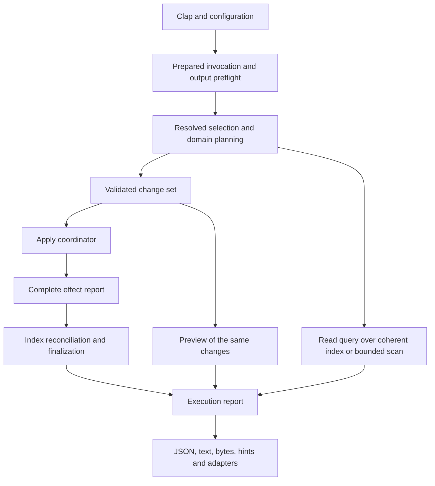

# Rust architecture review and remediation sequence

Hyalo needs stronger ownership of operations and derived state. The existing crate split is
usable; another directory reorganization, another DTO layer or additional style lints will not
close the observed failure paths. The proposed refactoring keeps the workspace and migrates
real consumers onto a small set of checked boundaries.

This is a design review and a set of planned changes, not evidence that those guarantees
already hold. The full baseline findings are retained in [[reviews/astra-code-review-2026-09-09]].
Every finding has one closure owner in the map below, including the six additional parent
findings and the single R05/S13 duplicate.

## Review basis and boundaries

Baseline: `857517a2c9be9a1c4a8b1c0b451082c81e6ecb09`, inspected on 2026-09-10.
Three independent GPT-6 Astra xhigh architecture assessments covered mutation/filesystem,
document/query/index, and CLI/output/adapter contracts. The parent inspected workspace/public
surfaces, CI/gates, prior iteration plans, combined their designs, and checked the complete
finding map. Architecture observations below are source-supported; runtime proof of the prior
bugs remains the preceding review's evidence. API names are proposed sketches, not implemented
or compiler-verified declarations.

The release build succeeded before final documentation dogfooding. Source code is unchanged by
this planning work. Plans start after iteration 289. Iteration 287 remains in progress solely
for the user-deferred Homefinder consumer task; it is outside this queue and is not a blocking
prerequisite. Existing historical plans are not marked fixed or complete by this review.

The earlier work is relevant: [[iterations/iteration-225-arch-thin-dispatch-typed-hints-core-facade]],
[[iterations/iteration-226-arch-lint-crate-index-journal]],
[[iterations/iteration-285-typed-output-structs]], and
[[research/stability-retrospective-2026-09-06]]. Those delivered useful boundaries and evidence.
This review does not claim the new abstractions are unprecedented; it identifies where the
existing boundaries still fail to control their callers.

## Current architecture and specific structural gaps

| Area | Current evidence | Structural consequence |
|---|---|---|
| Request setup | `run.rs` resolves files-from after hint capture and repeats view/config merging; `commands/inputs.rs` uses `first()` under single-file policy. | Cardinality, empty scope and effective options remain conventions on mutable argument bags. |
| Command context | `dispatch.rs::CommandContext` mixes immutable configuration, mutable snapshot, hint observations, counters and exit override. | Handlers can change global execution/output policy while performing domain work. |
| Write lifecycle | Commands mutate, then call `MutationJournal`, then may return before flush; `commands/journal.rs` explicitly describes dropping dirty unflushed state. | A shared journal cannot ensure maintenance if callers control whether it is reached. |
| Filesystem identity | `mv.rs` uses canonical referent equality for entry moves and string destination keys; indexed regex rebuilds paths from snapshot strings. | Lexical path, followed file, movable entry and catalog target are conflated. |
| Persistence | `fs_util.rs` provides useful sibling-temp replacement but post-persist permission updates can fail; config writers truncate in place. | `Result<()>` does not describe committed-but-finalization-failed effects. |
| Ambient policy | `fs_util.rs::PHASE` changes durability/progress process-wide; link alias mode also uses global state. | Concurrent or nested library uses can inherit unrelated invocation policy. |
| Document syntax | Frontmatter framing has multiple loops plus a lint substring splitter; body classification is split across LineScanner, BodyState and BodySpans. | Readers, writers, lint and structural visitors disagree about the same source bytes. |
| Query evaluation | `bm25.rs` mixes document eligibility with scoring over flat clauses. | Partial phrases and negative phrases gain incorrect Boolean meanings. |
| Link identity | Discovery, rewrite resolution and graph construction independently normalize targets; resolver caches may contain only paths. | Backlinks, alias handling and repair policy can disagree with displayed resolved links. |
| Derived state | `SnapshotIndex` exposes selective entry/graph operations; named refresh and journal updates manually copy subsets. | Entries, anchors, catalog, graph, token language and BM25 can become mutually inconsistent. |
| Output | Existing named Serialize structs become JSON strings in CommandOutcome, then are parsed by OutputPipeline; user errors are preformatted strings. | Type information is discarded prematurely, errors arrive after effects, and empty results bypass projections. |
| Companion contracts | npm already has typed DTOs, transports and diagnostics; generic Pi and raw-argv helpers use different paths. | Wrapper behavior and automatic-check promises diverge despite shared artifacts. |
| Quality gates | Mutation-journal and feature-fanout checks largely inspect source/help tokens; two other named checks return success as explicit stubs. | Presence of a helper/flag is measured instead of actual ownership, scope or failure behavior. The stubs are not in quality-gates CI. |

Source anchors: `crates/hyalo-cli/src/run.rs:1960`, `commands/inputs.rs:188`,
`commands/journal.rs:38`, `output.rs:58`, `dispatch.rs:159`;
`crates/hyalo-core/src/fs_util.rs:278`, `fs_util.rs:329`, `fs_util.rs:365`,
`link_rewrite.rs:592`, `scanner/mod.rs:183`, `frontmatter/parse.rs:819`,
`bm25.rs:656`, `index.rs:969`, `index.rs:1002`, `link_graph.rs:637`;
`crates/hyalo-mdlint/src/rules/spans.rs:393`.
Line numbers describe the reviewed baseline; find symbols again before implementation.

## Target ownership inside the existing crates

| Owner | Responsibility | Must not own |
|---|---|---|
| CLI request/application modules | Normalize Clap/config/view inputs once; select command capabilities, target cardinality, output plan and index intent. | YAML parsing internals or ad hoc low-level writes. |
| Core rooted filesystem module | Checked roots and relative names, captured source identity/version, confined I/O, exclusive creation/move, explicit write sessions. | Clap, shell hints, JSON envelopes, lint policy or snapshot publication. |
| Core domain modules | Transform captured bytes/values into validated edits; expose document facts, query eligibility and resolution results. | Printing, process exit, ambient config or invocation-wide apply orchestration. |
| CLI mutation coordinator | Prepare entire requested work, apply, retain every effect, finish durability, reconcile index and form an execution report. | Silently claiming rollback or deciding outcome from the final error alone. |
| Core index owner | Complete scan replacement, immutable catalog, coherent graph/search generations and bounded refresh. | Output formatting or command-specific selection/hints. |
| mdlint | Rules, configuration, severity, profiles and fix proposals over shared syntax facts. | Its own incompatible frontmatter/body boundaries or direct file publication. |
| CLI renderer/hints | Render typed reports; derive replay from resolved requests and raw argv. | Reconstructing scope from a partial copy or changing domain exit/error state. |
| npm/Pi adapters | Spawn/transport, typed decoding, diagnostics presentation and promised follow-up checks. | A second definition of CLI defaults, effect semantics or generated result schema. |

A proposed invocation flow is:



### Requests and capabilities

Keep the real Clap DTOs and generated TS input vocabulary. Introduce private-field prepared
requests and concrete command-family specs, not one enormous request with every option. A
single target resolves to one captured selection, an explicit empty input or a user error;
multiple targets never disappear through `first()`. An explicit empty collection is distinct
from default whole-vault scope.

An exhaustive command-capability match establishes output/count/projection support, selection
policy and effect/index role before any mutation. Normalize aliases and nested actions before
looking up capabilities. `IndexIntent::Drop` resolves its destination but does not load an
index just to delete it. Preserve the explicit CWD-relative index-path contract.

Output preflight rejects incompatible modes and malformed jq before effects. Compilation
itself must be bounded; moving an unsafe compiler into the main process is not a fix. The
minimal worker seam starts with preflight and is completed by the resource-isolation plan.

### Prepared operations and effects

Use types to distinguish proof of validation from an arbitrary path or byte string. Prefer
private fields and consuming apply APIs; cloning execution authority should not be routine.
These are illustrative shapes, with concrete error/source storage types chosen during the
migration:

```rust
struct CapturedInput { /* root, entry/referent identity, version, bounded source */ }
struct PreparedChangeSet { /* validated edits, target identities, preview */ }
struct ApplyReport { /* every path effect and finalization error */ }

enum EffectState {
    Committed,
    CommittedWithFinalizationError,
    FailedBeforeCommit,
    NotAttempted,
    Restored,
    RestoreFailed,
}

enum IndexDisposition {
    NotUsed,
    Updated,
    Invalidated,
    UpdateFailed,
}

struct ExecutionReport {
    /* command-specific result/error, effects, diagnostics, completeness, status */
}
```

The coordinator validates exact rendered YAML and selectors before the first write, not just
selected schema conditions. Index finalization must be mandatory from the first migrated
command, before the later index-owner refactor exists. A commit can succeed while chmod,
fsync, index persistence or output fails; effects therefore live outside the fallible final
result. Existing `PartialExecuteReport` is a useful starting point, whereas parallel
`execute_plans` currently discards successful paths after another result fails.

Planning cannot mean retaining a full vault's contents in memory. Use bounded captured data,
byte-range/header edits and temporary staging for large apply operations. Preview and apply
use the same transformation/validation; previews must not create note/config/index changes
or hidden replay manifests. Explicit write sessions replace process-global durability and
progress coupling. `finish()` is fallible and observed; Drop is cleanup, not proof of success.

### Rooted I/O, identity and concurrency

Distinguish note-vault, installation, configuration and explicitly selected index roots.
Catalog identities are not capabilities to open files. Check parent components and current
resolution at the I/O boundary; a validated path object only records a point-in-time fact.
The first implementation closes static escapes while honestly retaining any existing
canonicalize-then-open race limit. Handle-relative race-resistant backends are a separate
security guarantee and must not be implied by the type name.

A move acts on a directory entry; a normal edit may follow an in-vault symlink. Canonical
referent equality cannot establish a safe case-only rename. No-replace execution is required
in addition to collision planning: Rust's standard rename can replace a destination.
Filesystem equivalence cannot be implemented by lowercasing on macOS or by using Hyalo's
semantic link-case setting. Preserve supported regular-file case-only moves through a tested
backend; explicitly reject unsafe cases before writes.

Capture version/identity from the same input used to transform, and check before commit.
Use content fingerprints where mtime/size cannot distinguish edits. That detects stale input;
it is not a kernel compare-and-swap against arbitrary editors. A cooperative writer lease,
if introduced, needs explicit root ordering and lifecycle and cannot claim to exclude other
editors. Never retry a toggle/append automatically from stale data. Guarded rollback must
never overwrite an unrelated concurrent edit.

### Shared document facts, query semantics and resolution

Split this work into frontmatter framing/budgets and Markdown body syntax. A shared frame
holds source ranges, newline/BOM policy and exact delimiter boundaries; the bounded reader
stops after allowed frontmatter. Writer validation uses the same normal reader budgets.
The body service supplies visibility and spans for structural visitors and fix rules. Raw
full-text search remains allowed to search code/comments; structural visibility is a distinct
policy, not an excuse to remove searchable text.

Do not build a full YAML/Markdown concrete-syntax tree merely to share framing and visibility.
Retain the useful existing splicer and scanner, compare current implementations against a
source corpus, migrate all consumers and delete the superseded policy loops. YAML block
scalar links need bounded lexical context and source spans, not stripping everything after #.

Query eligibility uses typed Term/Phrase atoms and set operations before BM25 ranking.
Preserve Hyalo's existing flat OR behavior; introducing operator precedence is a product
change outside this refactor. Score only satisfied clauses and use an independent simple
reference evaluator in tests.

One immutable link catalog carries all paths/stems/aliases and explicit completeness.
Resolution returns target identity or missing/ambiguous/external states; rewrite policy then
decides whether and how to change authored spelling. Do not force every occurrence into a
resolved edge or discard unresolved edges from metrics. Remove process-global alias options
from migrated resolution calls.

### Coherent index state

Replace complete scan products, including anchors, language, tokens and diagnostics. The
runtime index owner controls catalog/graph/search generation and does not expose partially
updated state to queries or serialization. Keep persisted DTO compatibility separate from
internal ownership; public `IndexEntry` fields cannot simply be made private in a published
crate without wrappers, deprecation or an explicit version policy.

A target rename, alias edit or new ambiguous stem can change links from unmodified sources.
Retain raw occurrences and initially rebuild catalog/graph once per affected batch. Rebuild
or invalidate BM25 coherently. Do not combine this first correction with a new snapshot
format, database and sophisticated incremental scorer. Add checked expansion budgets before
new reconstruction paths: compact snapshots can otherwise amplify allocations dramatically.
Optimize only after disk/index parity holds, using measured operation counts as well as time.

### Results, diagnostics and agent contracts

The result DTO work already exists. Keep those structs and ts-rs; convert to Value once at
the heterogeneous renderer boundary instead of serialize-to-string then parse. Dynamic
frontmatter remains Value. Use typed errors and diagnostics internally, preserve successful
wire shapes and define optional additive effect/error fields deliberately with npm tests.
Distinct raw text and raw byte variants remain essential for read and NUL filename output.

Hints apply a named transformation to the complete resolved request. Store raw argv; quote
only for display, and never pretend POSIX display is native Windows-shell syntax. If a stdin
selection cannot be represented within the hint budget, omit the executable continuation
rather than broaden it. Scope preservation assumes unchanged input/config; apply still checks
captured source versions. Generic and typed Pi paths share diagnostic rendering and the same
post-write effects for follow-up lint.

## Decisions and alternatives

- Keep core, mdlint, CLI and xtask. Modules with enforced ownership come before new crates.
- Keep synchronous Rust and Rayon where useful; no async runtime, service, event bus,
  dependency-injection container or database is required for the identified failures.
- Use concrete errors at meaningful boundaries and anyhow for contextual unexpected errors;
  neither replace every Result nor add wrappers around strings without an invariant.
- Existing public Rust APIs and generated npm contracts need compatibility treatment.
  A facade comment does not permit silent breaking visibility changes.
- Do not call a cache journal a transaction. State atomic replacement, partial apply,
  conflict detection, durability and race resistance as separate guarantees.
- Do not preserve known wrong results merely to claim a behavior-preserving refactor.
  Record intentional fixes and keep unaffected bytes/formats stable.
- Do not add a duplicate schema generator or a giant command-result enum. Current DTOs and
  ts-rs are sufficient once execution/output ownership is corrected.

The design follows Rust API guidance on enforcing input validity through types or boundary
checks, private fields for invariant-owning values, and explicit fallible finalization.
These are supporting principles, not evidence that the proposed implementation is correct.
See [dependability](https://rust-lang.github.io/api-guidelines/dependability.html) and
[future proofing](https://rust-lang.github.io/api-guidelines/future-proofing.html).
The I/O plan must respect actual platform semantics of
[std::fs::rename](https://doc.rust-lang.org/std/fs/fn.rename.html) and the locked-version
[tempfile persistence API](https://docs.rs/tempfile/3.27.0/tempfile/struct.NamedTempFile.html).

## Execution order and validation cost

The original 25 drafts were too fine-grained for the repository's one-iteration/one-PR
workflow. At the user's request on 2026-09-10, they are replaced by six larger blocks.
Each combines structural migration and its relevant bug regressions. Architecture still
comes first inside each block, while dependent blocks consume the resulting stable APIs.

There are six planned branch/review/full-validation/PR checkpoints instead of 25, a 76%
reduction in checkpoint count. This is not a prediction of elapsed time or an exact number
of test processes: CI still runs its required jobs and repairs can require another pass.
Focused tests run between internal stages. Full workspace/asset checks run on the integrated
block candidate, and unchanged-tree results are reused. Internal sections do not trigger
another commit, PR, complete suite or CI wait. Repository-required gates and final-head
review/CI remain mandatory; no checks are disabled to obtain this reduction.

| Block | Outcome | Owned findings |
|---|---|---|
| [[iterations/iteration-290-execution-and-filesystem-foundations]] | Execution and filesystem foundations | shared foundations |
| [[iterations/iteration-291-document-parsing-and-lint-consistency]] | Document parsing and lint consistency | S05, S09, S11, S13, R05, R11, R01, R09, R10, R12, R13, R14 |
| [[iterations/iteration-292-query-resolution-and-index-coherence]] | Query, resolution and index coherence | R02, R03, C13, R04, R06, R07, R08, R15, S10 |
| [[iterations/iteration-293-mutation-migration-and-data-safety]] | Mutation migration and data safety | S01, S02, S03, S04, S06, S08, C05, C01, S07, S12, A01, A05 |
| [[iterations/iteration-294-cli-agent-and-documentation-contracts]] | CLI, agent and documentation contracts | C02, C03, C04, C06, C07, A02, A03, C08, C09, C10, C11, C12, C14, C15, A06 |
| [[iterations/iteration-295-resource-safety-and-final-verification]] | Resource safety and final verification | A04, R16 |

The serial dependency chain is 290 → 291 → 292 → 293 → 294 → 295. Request preparation
already supplies effective query inputs and HintDemand in 290, so search correctness and
no-hint I/O in 292 do not depend on later hint serialization in 294. S10's complete budget
and adversarial checks run in 292 before broader snapshot reconstruction. Jq guarantees
remain truthful in 294 and are updated after tested isolation lands in 295.

Each block has a single completion-gate section. No automatic loop should interpret its
internal stages as iterations. Keep at most one implementation writer per checkout and
use fresh implementation/review contexts per block when execution is authorized.
The external consumer task in iteration 287 remains deferred and outside this queue.

## Complete finding-to-plan map

All 50 ledger rows are retained: 44 independent-review rows, with R05 duplicating S13,
plus six parent findings. Each of the 49 distinct finding groups has exactly one closure
owner. Foundational work may fix a finding earlier; its owner verifies and extends the
regression evidence, without repeating implementation or opening another fix PR.

| ID | Finding | Baseline evidence | Closure owner |
|---|---|---|---|
| S01 | Confine all init/deinit artifacts before modifying them | Reproduced | [[iterations/iteration-293-mutation-migration-and-data-safety]] |
| S02 | Reject moves from a symlink onto its referent | Reproduced | [[iterations/iteration-293-mutation-migration-and-data-safety]] |
| S03 | Detect filesystem-equivalent batch destinations | Reproduced | [[iterations/iteration-293-mutation-migration-and-data-safety]] |
| S04 | Recheck confinement before indexed regex reads | Reproduced | [[iterations/iteration-293-mutation-migration-and-data-safety]] |
| S05 | Recognize complete frontmatter delimiters before body fixes | Reproduced | [[iterations/iteration-291-document-parsing-and-lint-consistency]] |
| S06 | Replace configuration files atomically | Source-supported; not runtime-reproduced | [[iterations/iteration-293-mutation-migration-and-data-safety]] |
| S07 | Preflight batch transformations and account for partial writes | Reproduced | [[iterations/iteration-293-mutation-migration-and-data-safety]] |
| S08 | Recover single-file moves when link rewriting fails | Reproduced | [[iterations/iteration-293-mutation-migration-and-data-safety]] |
| S09 | Enforce reader parser budgets on generated frontmatter | Reproduced | [[iterations/iteration-291-document-parsing-and-lint-consistency]] |
| S10 | Bound expanded BM25 token bytes before reconstruction | Source-supported; not runtime-reproduced | [[iterations/iteration-292-query-resolution-and-index-coherence]] |
| S11 | Limit frontmatter reads before allocating complete lines | Source-supported; not runtime-reproduced | [[iterations/iteration-291-document-parsing-and-lint-consistency]] |
| S12 | Detect concurrent frontmatter changes during tag renames | Source-supported; not runtime-reproduced | [[iterations/iteration-293-mutation-migration-and-data-safety]] |
| S13 | Read the complete permitted frontmatter prefix | Reproduced | [[iterations/iteration-291-document-parsing-and-lint-consistency]] |
| R01 | Exclude literal regions before running native task rules | Reproduced | [[iterations/iteration-291-document-parsing-and-lint-consistency]] |
| R02 | Evaluate optional phrases without globally rejecting documents | Reproduced | [[iterations/iteration-292-query-resolution-and-index-coherence]] |
| R03 | Preserve phrase boundaries when evaluating negation | Reproduced | [[iterations/iteration-292-query-resolution-and-index-coherence]] |
| R04 | Invalidate BM25 postings after refreshing a named file | Reproduced | [[iterations/iteration-292-query-resolution-and-index-coherence]] |
| R05 | Read frontmatter through the shared parser budget | Duplicate of S13 | [[iterations/iteration-291-document-parsing-and-lint-consistency]] |
| R06 | Build graph keys using the shared target-resolution semantics | Reproduced | [[iterations/iteration-292-query-resolution-and-index-coherence]] |
| R07 | Include aliases when rebuilding the snapshot resolver | Reproduced | [[iterations/iteration-292-query-resolution-and-index-coherence]] |
| R08 | Refresh self-anchor metadata with other scanned fields | Reproduced | [[iterations/iteration-292-query-resolution-and-index-coherence]] |
| R09 | Classify heading and task syntax after comment suppression | Reproduced | [[iterations/iteration-291-document-parsing-and-lint-consistency]] |
| R10 | Ignore directive-shaped text inside inline code | Reproduced | [[iterations/iteration-291-document-parsing-and-lint-consistency]] |
| R11 | Preserve block-scalar content during frontmatter link scanning | Reproduced | [[iterations/iteration-291-document-parsing-and-lint-consistency]] |
| R12 | Include single-digit sequence numbers in template globs | Reproduced | [[iterations/iteration-291-document-parsing-and-lint-consistency]] |
| R13 | Strip only valid ATX closing hash sequences | Reproduced | [[iterations/iteration-291-document-parsing-and-lint-consistency]] |
| R14 | Remove the invalid ASCII precondition on section filters | Reproduced | [[iterations/iteration-291-document-parsing-and-lint-consistency]] |
| R15 | Avoid full-graph traversals for each journaled file | Source-supported; not runtime-reproduced | [[iterations/iteration-292-query-resolution-and-index-coherence]] |
| R16 | Locate the platform-specific release executable | Source-supported; not runtime-reproduced | [[iterations/iteration-295-resource-safety-and-final-verification]] |
| C01 | Reject unsupported --count before executing mutations | Reproduced | [[iterations/iteration-293-mutation-migration-and-data-safety]] |
| C02 | Preserve resolved lint selection in apply hints | Reproduced | [[iterations/iteration-294-cli-agent-and-documentation-contracts]] |
| C03 | Carry auto-link exclusions into the apply command | Reproduced | [[iterations/iteration-294-cli-agent-and-documentation-contracts]] |
| C04 | Preserve repair exclusions in links-fix hints | Reproduced | [[iterations/iteration-294-cli-agent-and-documentation-contracts]] |
| C05 | Route drop-index's global index path to the deletion target | Reproduced | [[iterations/iteration-293-mutation-migration-and-data-safety]] |
| C06 | Preserve body-search constraints in find follow-up hints | Reproduced | [[iterations/iteration-294-cli-agent-and-documentation-contracts]] |
| C07 | Preserve filename projections for empty files-from input | Reproduced | [[iterations/iteration-294-cli-agent-and-documentation-contracts]] |
| C08 | Surface successful-command diagnostics in the generic Pi tool | Reproduced | [[iterations/iteration-294-cli-agent-and-documentation-contracts]] |
| C09 | Recognize raw argv output flags before injecting defaults | Reproduced | [[iterations/iteration-294-cli-agent-and-documentation-contracts]] |
| C10 | Apply the promised lint guardrail to hyalo_set | Reproduced | [[iterations/iteration-294-cli-agent-and-documentation-contracts]] |
| C11 | Emit individual paths in the bulk-update recipe | Reproduced | [[iterations/iteration-294-cli-agent-and-documentation-contracts]] |
| C12 | Make the documented OKF CI gate inspect drift explicitly | Reproduced | [[iterations/iteration-294-cli-agent-and-documentation-contracts]] |
| C13 | Skip diagnostic body probes when hints are disabled | Source-supported; not runtime-reproduced | [[iterations/iteration-292-query-resolution-and-index-coherence]] |
| C14 | Preserve existing named views during the Pi tidy workflow | Reproduced | [[iterations/iteration-294-cli-agent-and-documentation-contracts]] |
| C15 | Document alias resolution as opt-in | Reproduced | [[iterations/iteration-294-cli-agent-and-documentation-contracts]] |
| A01 | Batch task mutation hides earlier effects | Reproduced / inspected live help | [[iterations/iteration-293-mutation-migration-and-data-safety]] |
| A02 | Single-input cardinality/empty/error contracts | Reproduced / inspected live help | [[iterations/iteration-294-cli-agent-and-documentation-contracts]] |
| A03 | Leading-hyphen hints fail | Reproduced / inspected live help | [[iterations/iteration-294-cli-agent-and-documentation-contracts]] |
| A04 | Recursive jq aborts despite resource promise | Reproduced / inspected live help | [[iterations/iteration-295-resource-safety-and-final-verification]] |
| A05 | Physical alias toggles same task twice | Reproduced / inspected live help | [[iterations/iteration-293-mutation-migration-and-data-safety]] |
| A06 | README/help guarantees and actual behavior disagree | Reproduced / inspected live help | [[iterations/iteration-294-cli-agent-and-documentation-contracts]] |

### Other review observations with explicit ownership

- Source-supported ambient write-session coupling and post-persist errors: rooted operations
  and prepared effects, then complete writer migration. No new reproduced incident is claimed.
- Source-supported parallel link execution discarding successful results: complete writer
  migration and partial-failure regression coverage.
- Public mutable runtime state and facade compatibility: index-owner migration plus wrappers
  and an explicit public API policy, not a silent breaking visibility change.
- Syntactic quality gates and success-returning stubs: final behavioral-gates iteration.
- bincode/yaml-rust maintenance warnings: resource/dependency iteration. No known exploitable
  vulnerability was found by the recorded audits; refresh and disposition them honestly.
- Long-help context cost, repeated promotional guarantees and weak recipe validation:
  executable-documentation iteration, then a held-out comparison in the final evaluation.

## What completion must prove

The strongest tests compare effects and independent paths: no writes on deterministic
preflight failure, complete observed effects after injected I/O failure, source conflict
preservation, preview/apply scope equality, writer/reader budget agreement, disk/index/query
parity, and actual execution of documented recipes. The expected output must not be copied
from the same flawed helper under test. Include Linux/macOS/Windows runtime coverage where
behavior is platform-dependent, and compact bounded tests for hostile inputs.

Architecture success is measurable: migrated commands no longer have direct write/flush
bypasses; no successful in-process result is parsed back from a JSON string; all structural
consumers use one syntax authority; catalog changes update untouched-source resolution; no
partially refreshed index is served; and generic/typed adapters expose the same diagnostics.
Performance gates measure body reads, reconstruction/allocation budgets and per-batch graph
work before making latency claims.

Agent fit is reassessed after these invariants hold, using identical unseen fixtures against
ordinary file tools/scripts. Measure task correctness, unintended edits, completeness,
recovery, tool calls/context and time. Static review, implementation history and enthusiastic
comments cannot substitute for that result. If live model evaluation is unavailable, retain
its acceptance as pending rather than claiming success from self-assessment.

## Consolidated planning verification

The six blocks replace the 25 uncommitted drafts; no implementation task is completed by
this consolidation. Verification checks full body preservation, every original substantive
task and stage acceptance condition, all finding ownership, the six-block dependency chain,
strict lint, whitespace and independent dependency review. Temporary captured originals
under `/tmp/hyalo-consolidated-planning` support the audit but are not execution prerequisites.

Use Hyalo's combined `read --frontmatter --lines 1:` mode or separate metadata/body reads
when editing these plans: standalone `--frontmatter` returns only YAML. The previous
planning-script misuse was corrected and body-presence checks remain mandatory. A06 owns
the misleading help wording; this does not establish a Hyalo write defect.

## Consolidation verification — 2026-09-10

The pending inventory contains exactly six plans, all with complete bodies and planned
status. All 254 original implementation tasks and stage acceptance conditions are retained;
the repeated per-draft completion gates are replaced by six block completion gates.
All 50 finding rows have one owner (49 distinct groups), and dependency metadata forms the
complete six-block chain. Independent review checked the grouping and actual plan bodies;
its stale-number references were corrected. Strict lint on all eight documents and
whitespace checks passed. No code implementation, commit, push or CI run was performed.
